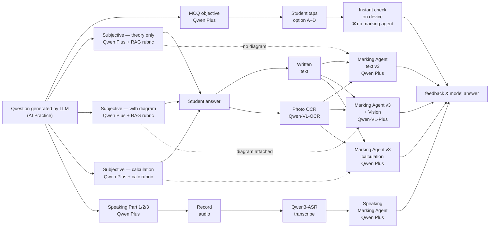
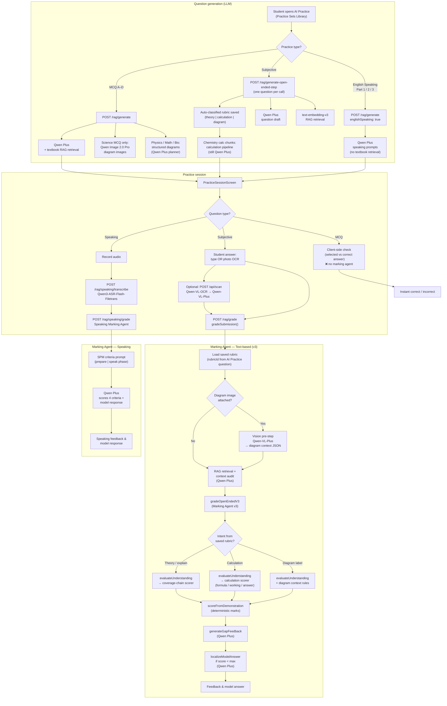
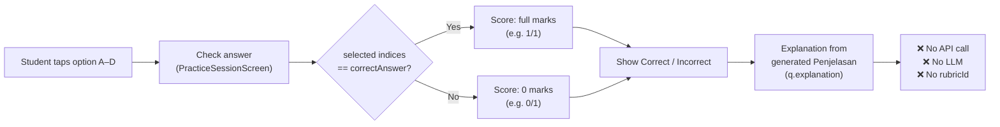
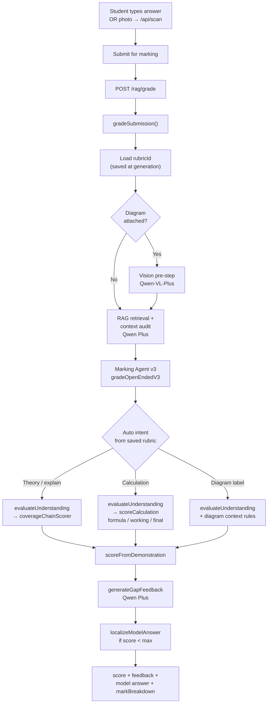

# AI Practice (Practice Set) — workflow & models

Updated to match the current **AI Practice** flow in `PracticeSetsLibraryScreen` → `PracticeSessionScreen` and backend `/rag/*` routes. No code changes — documentation only.

---

## Simple workflow (like slide diagram)

Left → right: **question generation** → **student answer** → **marking agent** → **output**.



### How to read this

| Column | Meaning |
|--------|---------|
| **Green path — generation** | LLM creates the question; model shown on each type box |
| **Middle — student answer** | How the student responds before marking |
| **Orange path — marking** | What grades the answer (or instant check for MCQ) |
| **End** | Feedback (+ model answer for subjective/speaking if not full marks) |

### Answer input (subjective only)

| Input | When | What happens |
|-------|------|----------------|
| **Written** | Student types in the answer box | Text goes straight to `POST /rag/grade` |
| **OCR** | Student takes photo / uploads image | `POST /api/scan` (Qwen-VL-OCR) → text placed in answer box → then `POST /rag/grade` |

OCR is **not** a marking agent — it only reads handwriting/photo into text.

### Which marking agent for each type?

| Question type | Diagram? | Answer input | Marking agent |
|---------------|----------|--------------|---------------|
| **MCQ objective** | May show diagram in question | Tap A–D | **None** — device compares to `correctAnswer` |
| **Subjective theory** | No | Written **or** OCR | **Marking Agent text v3** |
| **Subjective diagram** | Yes (`diagramImageUrl`) | Written **or** OCR | **Marking Agent v3 + Vision** |
| **Subjective calculation** | No | Written **or** OCR | **Marking Agent v3 calculation** |
| **Speaking** | — | Record audio | **Qwen3-ASR** → **Speaking Marking Agent** |

---

## High-level flow (with marking agents)



---

## Marking agent — internal steps (subjective)

This is what runs inside **POST /rag/grade** after the student submits a subjective answer in AI Practice.

```mermaid
flowchart LR
  subgraph INPUT["Inputs from practice session"]
    Q["question + rubricId\n(from generate-open-ended-step)"]
    A["studentAnswer\n(typed or OCR text)"]
    D["diagramImageUrl\n(optional)"]
  end

  subgraph PREP["gradeSubmission — preparation"]
    P1["analyzeQuestion\n+ LLM type classifier"]
    P2["infer maxScore"]
    P3["Vision: diagram context\nQwen-VL-Plus"]
    P4["Retrieve textbook chunks\ntext-embedding-v3"]
    P5["Context audit\nQwen Plus"]
  end

  subgraph V3["Marking Agent v3 — gradeOpenEndedV3"]
    V1["Load Assessment Case\n(ACF) via rubricId"]
    V2["evaluateUnderstanding\nQwen Plus — map student\nquotes to rubric units"]
    V3{markRule kind}
    V3 -->|coverage_chain| V4A["coverageChainScorer"]
    V3 -->|calculation| V4B["scoreCalculation\nformula → working → final"]
    V3 -->|fixed_set / other| V4C["unit + relation scoring"]
    V4A --> V5["scoreFromDemonstration"]
    V4B --> V5
    V4C --> V5
    V5 --> V6["generateGapFeedback\nQwen Plus"]
    V6 --> V7["localizeModelAnswer\nQwen Plus\n(only if not full marks)"]
  end

  subgraph OUTPUT["Returned to mobile"]
    O1["score / maxScore"]
    O2["feedback"]
    O3["modelAnswer"]
    O4["markBreakdown"]
  end

  Q --> P1
  A --> P1
  D --> P3
  P1 --> P2 --> P4 --> P5 --> V1
  P3 --> P4
  V1 --> V2 --> V3
  V7 --> O1
  V7 --> O2
  V7 --> O3
  V5 --> O4
```

---

## Marking: MCQ (objective) vs Subjective — specified

### MCQ (objective) — **no marking agent**



| Item | Detail |
|------|--------|
| **Detected as MCQ when** | Question has `options[]` **or** `questionType` matches `mcq` / `multiple_choice` |
| **Submit button** | **Check answer** |
| **Marking logic** | `isSelectionCorrect(selected, correctIndices)` — compares student selection to `correctAnswer` (letter A–D, index, or multi-select) |
| **Score rule** | Binary: **full marks if correct, 0 if wrong** |
| **Feedback source** | Pre-generated `explanation` (Penjelasan from `/rag/generate`) — **not** from a marking agent |
| **Backend endpoint** | **None** |
| **Models used** | **None** at marking time |
| **rubricId** | Not used |

---

### Subjective (open-ended) — **Marking Agent v3**



| Item | Detail |
|------|--------|
| **Detected as subjective when** | Not MCQ and not speaking — typically `questionType: short_answer` from AI Practice |
| **Submit button** | **Submit for marking** |
| **Answer input** | Typed text **or** photo/upload → `POST /api/scan` (Qwen-VL-OCR) → text placed in answer box |
| **Marking agent** | **Marking Agent v3** (`gradeOpenEndedV3`) |
| **Backend endpoint** | `POST /rag/grade` |
| **Required from generation** | `rubricId`, `questionForGrade`, `maxMarks` (from `/rag/generate-open-ended-step`) |
| **Models at marking** | **Qwen Plus** (main agent); **Qwen-VL-Plus** if diagram image attached |
| **Score rule** | Partial marks allowed — rubric units / calculation stages |
| **Feedback source** | `generateGapFeedback` (LLM) |
| **Model answer** | Shown only when **score < maxScore** via `localizeModelAnswer` |

#### Subjective sub-types (inside the same Marking Agent v3)

| Sub-type | How it is chosen | Scoring branch |
|----------|------------------|----------------|
| **Theory / explain** | Rubric `intent` = explain, describe, discuss, etc. | `coverageChainScorer` — credit units + causal links |
| **Calculation** | Rubric `intent` = calculation (e.g. Chemistry mole questions) | `scoreCalculation` — formula → substitution/working → final answer |
| **Diagram-based** | Question stem or rubric references diagram/labels | Same v3 agent + **vision pre-step** if `diagramImageUrl` sent; diagram never credited unless student writes the point |

---

## Which marking agent handles what?

| Practice question type | Marking agent | Endpoint | Uses LLM? |
|------------------------|---------------|----------|-----------|
| **MCQ (objective)** | **None** — device compares `selected` vs `correctAnswer` | — | **No** |
| **Subjective — theory** | **Marking Agent v3** (text-based) | `POST /rag/grade` | Yes — Qwen Plus |
| **Subjective — calculation** | **Marking Agent v3** (calculation branch) | `POST /rag/grade` | Yes — Qwen Plus |
| **Subjective — diagram** | **Marking Agent v3** + vision pre-step | `POST /rag/grade` | Yes — Qwen-VL-Plus + Qwen Plus |
| English Speaking | **Speaking Marking Agent** | `POST /rag/speaking/grade` | Yes — Qwen Plus (after ASR) |

**Note:** OCR (`POST /api/scan`) is **not** a marking agent — it only converts a photo into text before `/rag/grade`.

---

## Corrections vs the previous diagram

| Previous diagram | Actual AI Practice workflow |
|------------------|----------------------------|
| Essay Writing → Qwen OCR | **Subjective** questions are generated with **Qwen Plus**. **Qwen-VL-OCR** is only for **student answer input** (photo/upload), not question generation. |
| MCQ → Qwen Max | MCQ generation uses **Qwen Plus** (default `QWEN_GRADING_MODEL`). |
| Theory diagram → Qwen Image 2.0 | **Qwen Image 2.0 Pro** is used for **science MCQ** diagram images when `generateImage` is enabled. Subjective diagram items use RAG + structured diagram specs, not necessarily image generation. |
| Theory only → Qwen Max | Subjective (theory) → **Qwen Plus** + RAG + saved rubric. |
| Calculation → Qwen Coder Plus | Calculation uses the **v3 calculation pipeline** with **Qwen Plus** — there is no `qwen-coder-plus` in the codebase. |
| Speaking → Qwen3-ASR only | **Qwen3-ASR** transcribes audio; **Qwen Plus** grades the transcript. |
| MCQ → Marking Agent (text) | MCQ is marked **on the device** (compare selection to `correctAnswer`). No `/rag/grade` call. |
| Separate “Marking Agent (Vision)” | Vision (**Qwen-VL-Plus**) is a **pre-step inside** `gradeSubmission` before Marking Agent v3 — not a standalone agent. |
| Separate “Marking Agent calculation” | Calculation marking is a **scoring branch inside Marking Agent v3** (`scoreCalculation`), not a separate agent. |

---

## Models used (practice set only)

| Stage | Model | Env override (optional) |
|-------|--------|-------------------------|
| MCQ / subjective / speaking **generation** | `qwen-plus` | `QWEN_GRADING_MODEL`, `RAG_MODEL_*` |
| RAG retrieval embeddings | `text-embedding-v3` | `QWEN_EMBEDDING_MODEL` |
| Science MCQ diagram images | `qwen-image-2.0-pro` | `RAG_IMAGE_MODEL` |
| Answer photo OCR | `qwen-vl-ocr` → `qwen-vl-plus` | `QWEN_OCR_MODEL`, `QWEN_VISION_MODEL` |
| Subjective marking (all types) | `qwen-plus` | `QWEN_GRADING_MODEL` |
| Diagram context at marking | `qwen-vl-plus` | `QWEN_VISION_MODEL` |
| Speaking transcription | `qwen3-asr-flash-filetrans` | — (hardcoded) |
| Speaking marking | `qwen-plus` | `QWEN_GRADING_MODEL` |

---

## API endpoints (practice set)

| Step | Endpoint |
|------|----------|
| Generate MCQ | `POST /rag/generate` |
| Generate subjective (step-by-step) | `POST /rag/generate-open-ended-step` |
| Generate English speaking | `POST /rag/generate` (`englishSpeaking: true`) |
| OCR student answer | `POST /api/scan` |
| Mark subjective answer | `POST /rag/grade` → Marking Agent v3 |
| Transcribe speaking | `POST /rag/speaking/transcribe` |
| Mark speaking | `POST /rag/speaking/grade` → Speaking Marking Agent |
